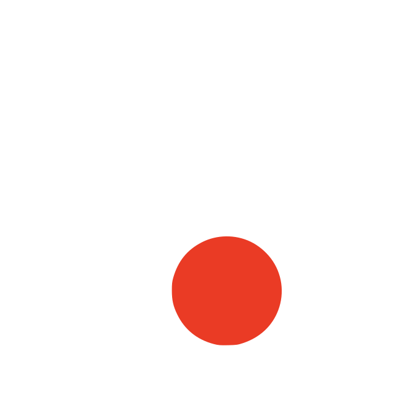

 

  

# hareki.

Kültür, teknoloji ve insan hikayelerinin kesişim noktası.

 

[Yaklaşım](#yaklaşım) · [İndeks](#indeks) · [İletişim](#iletişim)

 

---

 

## Yaklaşım

**Biz, kültür ve techne'nin sessiz kesişiminde çalışıyoruz.**

Hareki, sessizliğin dilini konuşan bir kreatif ajanstır. Gerçek etkinin bağırmasına gerek olmadığına inanıyoruz. O, yankılanır. Tıpkı iyi ciltlenmiş bir kitap veya kusursuz işleyen bir kod satırı gibi.

 

### Hareki Nedir?

> **hareki** / *isim.*  
> Harekete sahip olan, hareket eden; canlı, dinamik.

Dijital zanaatkarlığa entelektüel bir yaklaşım. Sadece web siteleri veya markalar inşa etmiyoruz; harekete geçen anlatılar kurguluyoruz. Analog medyanın dokunsal hissini modern teknolojinin hassasiyetiyle harmanlıyoruz.

 

---

 

## Hakkımızda

**Hareki, 2026'da, dijital dünyanın gürültüsüne karşı bir tepki olarak kuruldu.**

<table width="100%">
<tr>
<td width="65%" valign="top">

Biz, markaların ve kurumların hikayelerini anlatırken sadelik ve derinliği ön planda tutan bağımsız bir kreatif stüdyoyuz. Kalabalık internet ortamında, bağıran tasarımların değil, fısıldayan ve akılda kalan deneyimlerin gücüne inanıyoruz.

Yaklaşımımız akademiktir; her projeye bir araştırma tezi titizliğiyle başlarız. Tasarımımız zanaatkardır; her pikseli ve boşluğu bir anlam ifade edecek şekilde yerleştiririz. Teknolojimiz ise görünmezdir; karmaşık altyapıları pürüzsüz kullanıcı deneyimlerine dönüştürürüz.

</td>
<td width="5%"></td>
<td width="30%" valign="top">

**Disiplinler**

Marka Stratejisi  
Pazar Araştırması  
İçerik Stratejisi  
Sosyal Medya Stratejisi  
Marka Kimliği  
UI/UX Tasarım  
Sanat Yönetimi  
Editoryal Tasarım  
Web Geliştirme  
Kod Geliştirme  
Dijital Deneyim  
Prototipleme

</td>
</tr>
</table>

 

---

 

## Bir Projeye Başlamadan Önce

Bir projeye başlamadan önce ilk yaptığımız şey tasarım değildir. Önce dururuz. Dinleriz. İçinde bulunduğu sektörü, o sektörün dilini ve reflekslerini anlamaya çalışırız. Markanın geçmişine, bugüne kadar ne söylediğine ve belki daha önemlisi neyi hiç söylemediğine bakarız. Çünkü iyi bir iş, doğru sorular sorulmadan başlamaz.

Bu hazırlık süreci, piksel yerleştirmeden önce yapılan en kritik iştir. Çoğu projede ilk günler tasarımdan bilinçli olarak uzaktır; eskiz yoktur, arayüz yoktur, renk yoktur. Bunun yerine düşünme vardır. Acele edilmez. Çünkü ancak neyin gerçekten gerekli olduğunu anladığımızda, neyi dışarıda bırakacağımıza da karar verebiliriz.

 

---

 

## Herkes İçin Çalışmıyoruz

Herkes için çalışmıyoruz; bunu bir ayrıcalık olarak değil, bir netlik olarak görüyoruz. Acil teslimatlar, bitmeyen revizyon döngüleri ya da yalnızca trendlere yetişme beklentisi olan projeler için doğru adres olmayabiliriz. Aynı şekilde, sadece "daha güzel görünsün" talebiyle başlayan işlere de mesafeli dururuz.

Bizim için en iyi işler, anlatacak bir hikâyesi olan ve bu hikâyeye zaman tanımayı kabul eden markalarla ortaya çıkar. Niyetin net, sürecin sakin olduğu yerlerde çalışırız. Çünkü anlamlı sonuçlar, hızdan çok dikkatle; gösterişten çok kararlılıkla şekillenir.

 

---

 

## Metodoloji

<table width="100%">
<tr>
<td width="33%" valign="top">

**Strateji**

*Belirsizliği netleştiriyoruz.*

Marka Stratejisi  
Pazar Araştırması  
İçerik Stratejisi  
Sosyal Medya Stratejisi

</td>
<td width="34%" valign="top">

**Tasarım**

*Düşünceye biçim veriyoruz.*

Marka Kimliği  
UI/UX Tasarım  
Sanat Yönetimi  
Editoryal Tasarım

</td>
<td width="33%" valign="top">

**Teknoloji**

*Görünmez altyapıyı inşa ediyoruz.*

Web Geliştirme  
Kod Geliştirme  
Dijital Deneyim  
Prototipleme

</td>
</tr>
</table>

 

---

 

## İndeks

<table width="100%">
<tr>
<th align="left" width="30%">Müşteri</th>
<th align="left" width="35%">Proje</th>
<th align="left" width="20%">Disiplin</th>
<th align="left" width="15%">Yıl</th>
</tr>
<tr>
<td>Noveau Gallery</td>
<td>Exhibition 09</td>
<td>Sanat Yönetimi</td>
<td>2024</td>
</tr>
<tr>
<td>Vestra Foundation</td>
<td>Cultural Map</td>
<td>Marka Stratejisi</td>
<td>2024</td>
</tr>
<tr>
<td>Kolektif House</td>
<td>Digital Workspace</td>
<td>UI/UX Tasarım</td>
<td>2024</td>
</tr>
<tr>
<td>Base Istanbul</td>
<td>Artist Series</td>
<td>İçerik Stratejisi</td>
<td>2024</td>
</tr>
<tr>
<td>Mono Architectural</td>
<td>Silence in Space</td>
<td>Görsel Kimlik</td>
<td>2023</td>
</tr>
<tr>
<td>Atlas Publishing</td>
<td>The New Archive</td>
<td>Web Geliştirme</td>
<td>2023</td>
</tr>
</table>

 

---

 

## Altyapı

`TypeScript` · `React` · `Next.js` · `Tailwind CSS` · `Framer Motion` · `Node.js` · `PostgreSQL`

 

---

 

## İletişim

**Zamansız bir şeyler kurgulamaya hazır mısınız?**

Şu anda yeni projeler için takvimimiz açık. Hikayenizi konuşalım.

 

---

 

<table width="100%">
<tr>
<td width="33%" valign="top">

**Keşfet**

[Yaklaşım](#yaklaşım)  
[İndeks](#indeks)  
[İletişim](#iletişim)

**Kurumsal**

[Hakkımızda](#hakkımızda)  
[Kariyer](https://hareki.com/careers)  
[Gizlilik](https://hareki.com/privacy)  
[Yasal Uyarı](https://hareki.com/legal)

</td>
<td width="34%" valign="top">

**Takip Et**

[Instagram](https://instagram.com/wearehareki)  
[Twitter](https://twitter.com/wearehareki)  
[LinkedIn](https://linkedin.com/company/hareki)

**E-posta**

[hello@hareki.com](mailto:hello@hareki.com)

</td>
<td width="33%" valign="top">

**Lokasyonlar**

Kavala Köşkü  
Kadıköy, İstanbul

Grand Pera  
Beyoğlu, İstanbul

London Mayfair  
London, UK

</td>
</tr>
</table>

 

---

 

[hello@hareki.com](mailto:hello@hareki.com)

© 2026 Hareki · Est. 2026 · İstanbul

 

